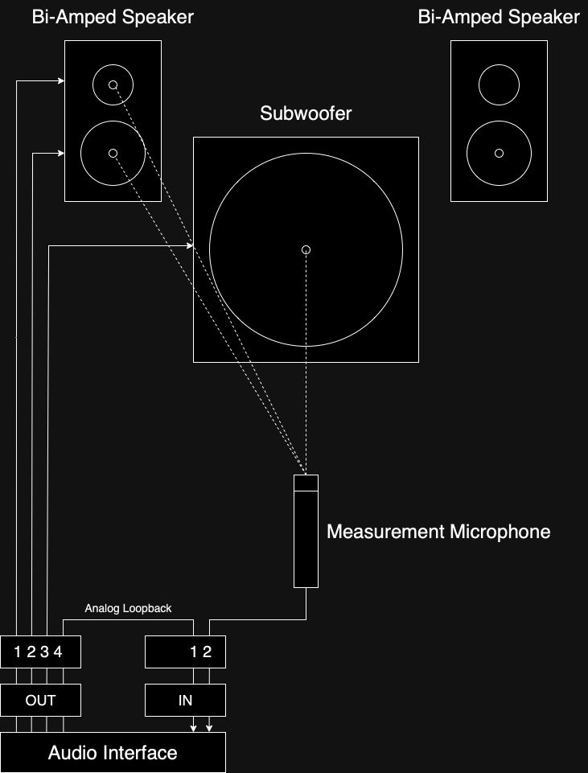

# Audio Time Shift Detector

Analyze time shift between several `.wav` files.  
Returns time shift in sample points and milliseconds between all given `.wav` files.

The time shift is precisely calculated by utilizing a special measurement file and cross-correlation.

## Table of Contents

- [Audio Time Shift Detector](#audio-time-shift-detector)
  - [Table of Contents](#table-of-contents)
  - [Usage](#usage)
    - [Supported File Types](#supported-file-types)
    - [Script Execution ](#script-execution-)
  - [Measurement File](#measurement-file)
  - [Use-cases / Application Examples](#use-cases--application-examples)
    - [Time-align audio tracks (e.g. multi-mic setup to avoid phase issues)](#time-align-audio-tracks-eg-multi-mic-setup-to-avoid-phase-issues)
    - [Time shift measurement to time-align multi-speaker setups](#time-shift-measurement-to-time-align-multi-speaker-setups)
  - [Testing](#testing)
  - [License](#license)
  - [Donation](#donation)

## Usage

Provide audio files in the `.wav` format within a folder.  
Ensure that the sample rate of all audio files matches.

### Supported File Types

This script supports `.wav` files with a wide range of sample rates and bit depths:

Tested sample rates and bit depths:
- Sample Rates:
    - 8000, 11025, 16000, 22050, 32000, 44100, 48000, 88200, 96000, 176400, 192000
- Bit Depths:
    - PCM: 8, 12, 24, 32
    - Floating Point: 32, 64

The script supports mono and stereo files. In the case of stereo files, ensure that both channels contain the same content. Otherwise, the results may be incorrect, and an error will be thrown.


### Script Execution <div id='script_execution' />

```atsDetect.py '/path/to/folder'```

In `dist` you can find a compiled version for macOS (arm64). It was compiled using pyinstaller. Execute it as follows:

```atsDetects '/path/to/folder'```

Compiled versions for Linux & Windows are not planned.

## Measurement File

Dirac impulses are sometimes used for time-alignment measurements.  
However, alterations in the frequency spectrum can cause signals to smear.  
For example, a high-passed Dirac impulse becomes highly smeared and is, therefore, not recommended for this scenarios.

Sine wave sweeps can be another option. However, in cases where we want to measure time alignment between a subwoofer and a tweeter, there may be no frequency overlap between both signals, making sweeps ineffective.

White noise contains all frequencies and is optimal for this type of measurement.  
For better results, the white noise signal is pulsed. A short sequence of noise is followed by a short sequence of silence. This noise-silence sequence is repeated 6 times to form the test signal. The length of the noise increases logarithmically, while the silence decreases logarithmically in each of the 6 intervals, allowing for better correlation between the reference signal and the measured signal.

The measurement file, `pulsedNoise.wav`, can be found in the `resources` folder.

The script used to generate this file, `TestFileGenerator`, is also available in the same directory. If you need to modify it for specific applications, feel free to contact me.

## Use-cases / Application Examples

### Time-align audio tracks (e.g. multi-mic setup to avoid phase issues)

**Example:**

A snare drum is recorded using two microphones. Both microphone recordings need to be time-aligned (phase-aligned).

Steps:
1. Check that the phase is not inverted.
2. Analyze both recordings with the script.
3. Adjust the timing of one of the tracks inside your DAW.

### Time shift measurement to time-align multi-speaker setups

In this example, we use the Audio Time Shift Detector to time-align a multi-speaker setup.

This is particularly useful when you can set a delay for each individual speaker (e.g., via DSP).

To measure the time delay between the speakers, it's crucial to have a measurement reference.

The reference is an analog loopback. The measurement file is played through each speaker one at a time. Both the measurement microphone signal (optimally placed at the listener’s position) and the reference signal (loopback) are recorded for each run.


**Example:**



1) **Tweeter:**
    - Play the measurement file to the tweeter (Out Channel 1) and the loopback (Out Channel 4).
    - Record the analog loopback as well as the microphone (In Channels 1 & 2).
    - Run the script on those two files, and note the time shift.

2) **Mid Range:**
    - Play the measurement file to the midrange speaker (Out Channel 2) and the loopback (Out Channel 4).
    - Record the analog loopback as well as the microphone (In Channels 1 & 2).
    - Run the script on those two files, and note the time shift.

3) **Analyze:**
    - Calculate the difference between the Tweeter and Midrange.

## Testing

In the `testing` directory, you can find the Reaper project I used for testing & verification.

- Track 1 contains the unchanged test file.
- Tracks 2 & 3 contain copies of that file, but with applied filters to mimic a frequency response change (e.g., simulating a speaker crossover system). If the reaFIR filter's edit mode is set to `precise`, it does not affect the phase.
- You can experiment with other EQs and filters to observe how the resulting phase shift introduces an additional time shift.

## License

This project is licensed under the MIT License - see the [LICENSE](LICENSE) file for details.

## Donation

If you find this script useful, consider paying me a coffee.
